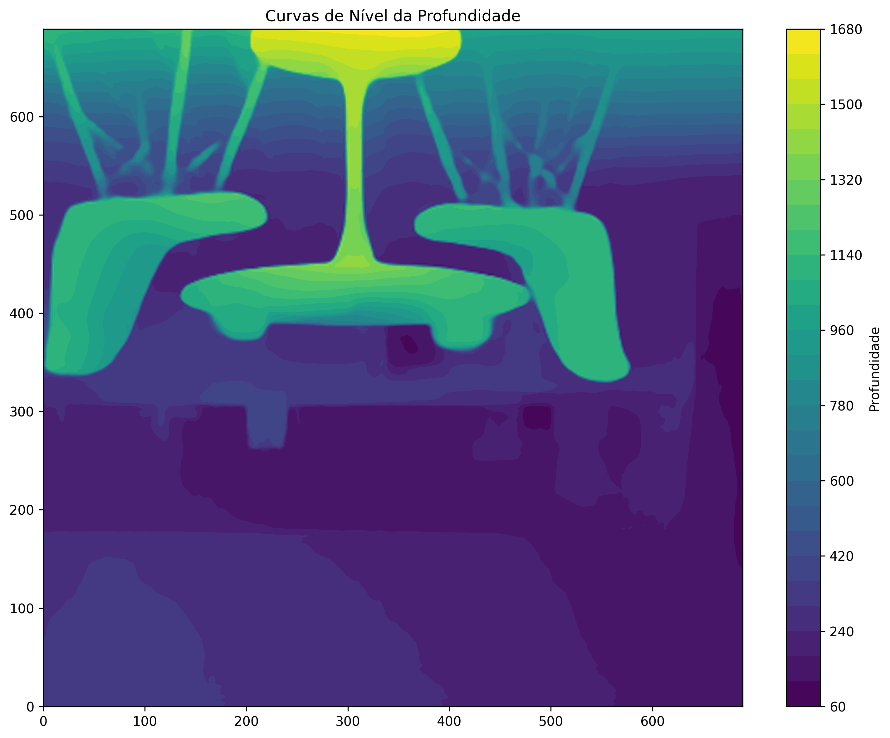

# MiDepth - Depth Estimation System

## Overview
This project is a depth estimation system that processes images and videos using MiDaS (Mixed Dense Architecture for Single-Image Depth Estimation) and Depth Anything. The system analyzes input media and generates depth maps, providing a comprehensive understanding of spatial relationships in the visual content.

## Features
- Real-time depth estimation for videos
- Integration with MiDaS and Depth Anything for accurate depth perception
- Support for various input formats
- Visual representation of depth information

## Technologies
- Python
- MiDaS (Mixed Dense Architecture for Single-Image Depth Estimation)
- Depth Anything V2
- Computer Vision libraries

## Installation

See [SETUP.md](SETUP.md) for detailed installation instructions.

## Usage

- Run the desired Python script for image or video depth processing.
- Example:
  ```bash
  python src/core/engine/main.py
  ```
  
## Examples

### Input Image


### Depth Result


### Contour Visualization


## License

This project is licensed under the GNU General Public License v3.0 (GPLv3).  
See the [LICENSE](LICENSE) file for details.

Copyright (C) 2025 Sunref and gm64x
